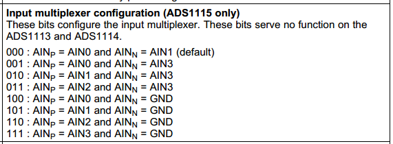

# ADC Guide
### 4-Channel 16-Bit ADC HAT(ads1115)


## Installation
**Please follow the steps strictly when installing,otherwise the installation may failed or even damage the module.**

1. Driver Installation，  **Only applied for Raspbian Jessie/Stretch.**

   ```bash
   # open tools directory
   cd tools

   # Install driver
   sudo ./install.sh -u adc_ads1115

   # sync all setting
   sync
   ```
   Power off Raspberry Pi

   Insert the HAT to Raspberry Pi

   Power up Raspberry Pi

2. List install status
   ```bash
   ./install.sh -l
   ```
3. Uninstallation
   ```bash
   sudo ./install.sh -u
   ```


<br><br>
## Usage

<div align="left">
<table style="border-style:none; border-width:0px;">
<tr align="center">
  <td>
    
  </td>
</tr>
<tr align="center">
  <td>
    Input Channels
  </td>
</tr>
</table>

channels 0-3 is differntial voltage, full scale range -2.048V - +2.048V 

channels 4-7 is absolute voltage of AIN0-AIN3, full scale range 0 - +2.048V

Read AIN0(channel 4) voltage(unit mV).
```bash
    cat /sys/devices/platform/soc/*04000.i2c/i2c-1/1-0048/in4_input
```
<div>
        <table border="0">
	  <tr align="center">
	    <th>INPUT</th>
	    <th>channel</th>
	    <th>/sys/.../XXX</th>
	  </tr>
	  <tr align="center">
	    <td>AIN0</td>
	    <td>4</td>
	    <td>in4_input</td>
	  </tr>
	  <tr align="center">
	    <td>AIN1</td>
	    <td>5</td>
	    <td>in5_input</td>
	  </tr>
	  <tr align="center">
	    <td>AIN2</td>
	    <td>6</td>
	    <td>in6_input</td>
	  </tr>
	  <tr align="center">
	    <td>AIN3</td>
	    <td>7</td>
	    <td>in7_input</td>
	  </tr>
	</table>
</div>

Read all channels the same time.
```bash
    ./ads1115.sh
```
